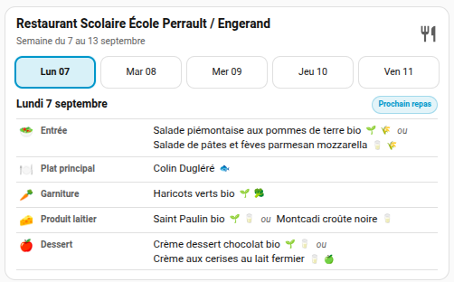

# Radis la Toque pour Home Assistant

[](https://hacs.xyz/)
[](https://www.home-assistant.io/)
[](LICENSE)

Intégration Home Assistant **non officielle** permettant de récupérer les menus publics publiés sur le site **Radis la Toque**, de sélectionner un ou plusieurs établissements et d'exposer les repas sous forme de capteurs, calendrier et carte Lovelace dédiée.

> **Statut : bêta.** Le parser a été validé sur deux corpus indépendants totalisant 20 établissements réels. Le site source ne fournit pas d'API publique documentée : une évolution importante de son format peut nécessiter une mise à jour de l'intégration.



## Fonctionnalités

- configuration entièrement via l'interface Home Assistant ;
- recherche d'établissement par nom, ville ou code postal ;
- plusieurs établissements configurables dans une même instance ;
- capteurs **Menu aujourd'hui**, **Prochain menu** et **Menu de la semaine** ;
- calendrier Home Assistant avec un événement par repas ;
- gestion des semaines de 4/5 jours, jours vides et choix multiples ;
- détection propre des PDF publiés sans menu ;
- enrichissement sémantique non bloquant (bio, poisson, viande, œuf, fruit, légume, etc.) ;
- carte Lovelace dédiée, responsive et sans dépendance frontend tierce ;
- icône originale fournie avec l'intégration, sans réutilisation d'assets RESTORIA.

## Installation avec HACS

Tant que le dépôt n'est pas encore référencé par défaut dans HACS :

1. HACS → **Intégrations** → menu ⋮ → **Dépôts personnalisés**.
2. Ajouter `https://github.com/guat37/ha-radis-la-toque` en catégorie **Integration**.
3. Installer **Radis la Toque**.
4. Redémarrer Home Assistant.
5. Paramètres → **Appareils et services** → **Ajouter une intégration** → `Radis la Toque`.
6. Rechercher puis sélectionner l'établissement.

### Carte Lovelace intégrée

Le JavaScript de la carte est livré **dans le même package HACS** que l'intégration et chargé automatiquement au démarrage de Home Assistant. Aucune ressource Lovelace manuelle n'est nécessaire.

Ajouter simplement une carte :

```yaml
type: custom:radis-la-toque-card
entity: sensor.mon_etablissement_menu_de_la_semaine
compact: true
default_day: smart
```

La carte apparaît également dans le sélecteur de cartes après le redémarrage de Home Assistant.

## Entités

Pour chaque établissement, l'intégration expose notamment :

- `Menu aujourd'hui` : repas du jour lorsqu'il existe ;
- `Prochain menu` : prochain jour de restauration disponible ;
- `Menu de la semaine` : semaine structurée dans les attributs ;
- `Menus de la cantine` : calendrier natif Home Assistant.

Les catégories sont conservées séparément : entrée, plat principal, garniture, produit laitier, dessert et autres. Les choix multiples restent des listes distinctes.

## Rafraîchissement

Les menus sont vérifiés toutes les 12 heures. Le client utilise les en-têtes HTTP conditionnels lorsque le serveur les fournit afin d'éviter de retélécharger un document inchangé.

## Tests et robustesse

La version bêta est validée sur :

- 10 scénarios synthétiques de non-régression ;
- 20 réponses PDF réelles provenant de 20 établissements distincts ;
- semaines complètes et partielles ;
- catégories manquantes ;
- journées vides ;
- choix multiples ;
- documents PDF valides mais sans menu publié ;
- couche semaine/calendrier/carte.

Les PDF réels ne sont pas redistribués dans ce dépôt. Les tests end-to-end peuvent utiliser un corpus local via `RLT_REAL_PDF_DIR`.

Voir [docs/TESTING.md](docs/TESTING.md).

## Confidentialité

L'intégration consulte uniquement les pages et PDF publics nécessaires à la récupération des menus. Elle ne nécessite aucun identifiant Radis la Toque et n'envoie aucune donnée personnelle au fournisseur.

## Projet non officiel

Ce projet n'est ni affilié, ni approuvé, ni maintenu par RESTORIA ou Radis la Toque. Les marques et noms cités appartiennent à leurs propriétaires respectifs. Aucun logo, pictogramme ou élément graphique propriétaire de RESTORIA n'est redistribué par ce projet.

## Support

Avant d'ouvrir une issue, joindre si possible les **diagnostics Home Assistant** de l'intégration et préciser l'établissement concerné. Ne publiez pas de données privées provenant de votre instance Home Assistant.

## Développement

Voir [CONTRIBUTING.md](CONTRIBUTING.md) et [docs/ARCHITECTURE.md](docs/ARCHITECTURE.md).
