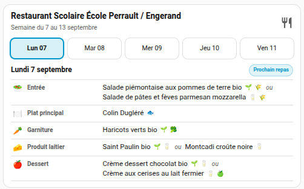
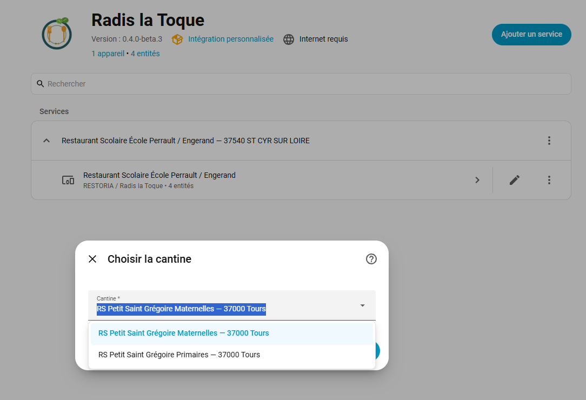
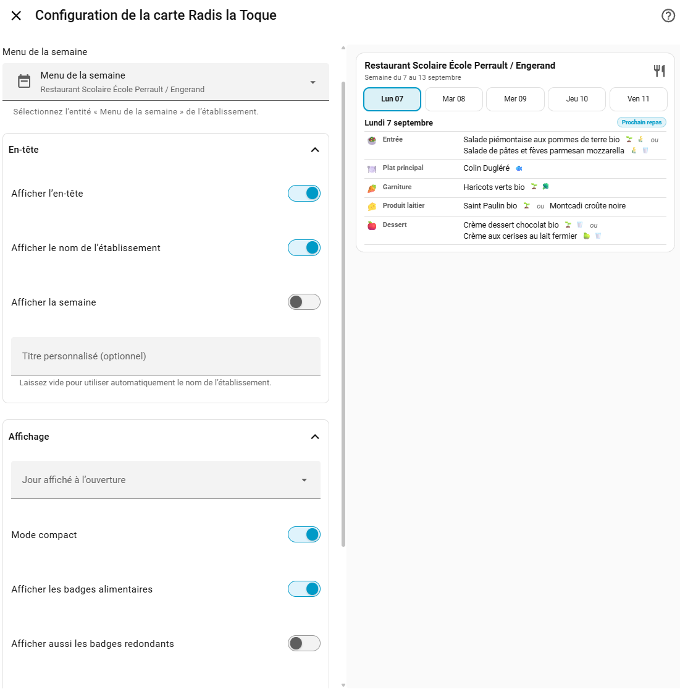
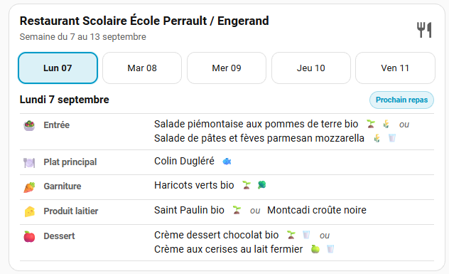
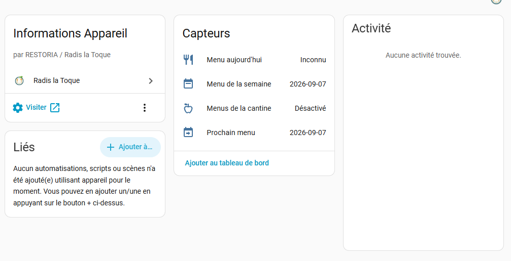

# Radis la Toque pour Home Assistant

[](https://hacs.xyz/)
[](https://www.home-assistant.io/)
[](LICENSE)

Intégration Home Assistant **non officielle** permettant de récupérer automatiquement les menus publics publiés sur le site **Radis la Toque** et de les afficher directement dans Home Assistant.

## Pourquoi cette intégration ?

Si, comme moi, vous en avez marre d'aller consulter le site Radis la Toque tous les jours pour savoir ce que votre enfant mange à la cantine, cette intégration est faite pour vous.

L'idée du projet est toute simple : récupérer automatiquement les menus publiés par Radis la Toque et les rendre accessibles directement dans Home Assistant, là où l'on consulte déjà le reste des informations de la maison.

Une fois votre établissement configuré, vous pouvez retrouver facilement :

* le menu du jour ;
* le prochain menu disponible ;
* les menus de la semaine ;
* les repas dans le calendrier Home Assistant ;
* une carte Lovelace dédiée pour consulter rapidement la semaine depuis votre tableau de bord.

L'objectif n'est pas de remplacer le site Radis la Toque, mais de rendre une information déjà publique plus simple à consulter au quotidien, sans avoir à retourner systématiquement sur le site.



> Le parser a été validé sur deux corpus indépendants totalisant 20 établissements réels. Le site source ne fournit pas d'API publique documentée : une évolution importante de son format peut nécessiter une mise à jour de l'intégration.


## Fonctionnalités

* configuration entièrement via l'interface Home Assistant ;
* recherche d'établissement par nom, ville ou code postal ;
* plusieurs établissements configurables dans une même instance ;
* capteurs **Menu aujourd'hui**, **Prochain menu** et **Menu de la semaine** ;
* calendrier Home Assistant avec un événement par repas ;
* gestion des semaines de 4/5 jours, jours vides et choix multiples ;
* détection propre des PDF publiés sans menu ;
* enrichissement sémantique non bloquant (bio, poisson, viande, œuf, fruit, légume, etc.) ;
* mise à jour de l'affichage lors du changement de date sans téléchargement inutile du menu ;
* carte Lovelace dédiée, responsive et sans dépendance frontend tierce ;
* icône originale fournie avec l'intégration, sans réutilisation d'assets RESTORIA ;
* diagnostics Home Assistant pour contrôler l'état des mises à jour.

## Installation avec HACS

Tant que le dépôt n'est pas encore référencé par défaut dans HACS :

1. HACS → **Intégrations** → menu ⋮ → **Dépôts personnalisés**.
2. Ajouter `https://github.com/guat37/ha-radis-la-toque` en catégorie **Integration**.
3. Installer **Radis la Toque**.
4. Redémarrer Home Assistant.
5. Paramètres → **Appareils et services** → **Ajouter une intégration** → `Radis la Toque`.
6. Rechercher puis sélectionner l'établissement.



### Carte Lovelace intégrée

Le JavaScript de la carte est livré **dans le même package HACS** que l'intégration et chargé automatiquement au démarrage de Home Assistant. Aucune ressource Lovelace manuelle n'est nécessaire.

Ajouter simplement une carte :

```yaml
type: custom:radis-la-toque-card
entity: sensor.mon_etablissement_menu_de_la_semaine
compact: true
default_day: smart
```

La carte apparaît également dans le sélecteur de cartes après le redémarrage de Home Assistant.





## Entités

Pour chaque établissement, l'intégration expose notamment :

* `Menu aujourd'hui` : repas du jour lorsqu'il existe ;
* `Prochain menu` : prochain jour de restauration disponible ;
* `Menu de la semaine` : semaine structurée dans les attributs ;
* `Menus de la cantine` : calendrier natif Home Assistant.

Les catégories sont conservées séparément : entrée, plat principal, garniture, produit laitier, dessert et autres. Les choix multiples restent des listes distinctes.



## Rafraîchissement

Les menus sont vérifiés toutes les 12 heures.

Le client utilise les en-têtes HTTP conditionnels lorsque le serveur les fournit afin d'éviter de retélécharger un document inchangé.

L'identifiant stable de l'établissement est conservé même lorsque le code de menu `Rxxxxx` utilisé par le site change. Le code courant est résolu automatiquement lors des mises à jour.

## Diagnostics et journalisation

Home Assistant permet de télécharger les diagnostics de chaque configuration **Radis la Toque** depuis :

**Paramètres → Appareils et services → Radis la Toque → menu ⋮ → Télécharger les diagnostics**

Les diagnostics indiquent notamment :

* si la dernière mise à jour a réussi ;
* la date de la dernière tentative ;
* la date de la dernière mise à jour réussie ;
* le résultat du dernier cycle ;
* des informations sur le menu actuellement chargé et le parser utilisé.

Les résultats possibles du dernier cycle incluent notamment :

* `menu_updated` ;
* `menu_unchanged` ;
* `menu_not_available` ;
* `update_failed`.

Pour activer temporairement une journalisation plus détaillée :

```yaml
logger:
  logs:
    custom_components.radis_la_toque: debug
```

Ces logs utilisent le système natif de Home Assistant. L'intégration ne crée aucun fichier de journalisation spécifique.

## Tests et robustesse

La version stable est validée sur :

* 10 scénarios synthétiques de non-régression ;
* 20 réponses PDF réelles provenant de 20 établissements distincts ;
* semaines complètes et partielles ;
* catégories manquantes ;
* journées vides ;
* choix multiples ;
* documents PDF valides mais sans menu publié ;
* couche semaine/calendrier/carte ;
* chargement automatique de la carte frontend ;
* compilation du composant Python.

Les PDF réels ne sont pas redistribués dans ce dépôt. Les tests end-to-end peuvent utiliser un corpus local via `RLT_REAL_PDF_DIR`.

Voir [docs/TESTING.md](docs/TESTING.md).

## Confidentialité

L'intégration consulte uniquement les pages et PDF publics nécessaires à la récupération des menus. Elle ne nécessite aucun identifiant Radis la Toque et n'envoie aucune donnée personnelle au fournisseur.

## Projet non officiel

Ce projet n'est ni affilié, ni approuvé, ni maintenu par RESTORIA ou Radis la Toque.

Les marques et noms cités appartiennent à leurs propriétaires respectifs. Aucun logo, pictogramme ou élément graphique propriétaire de RESTORIA n'est redistribué par ce projet.

## Support

Avant d'ouvrir une issue, joindre si possible les **diagnostics Home Assistant** de l'intégration et préciser l'établissement concerné.

Ne publiez pas de données privées provenant de votre instance Home Assistant.

## Développement

Voir [CONTRIBUTING.md](CONTRIBUTING.md), [docs/ARCHITECTURE.md](docs/ARCHITECTURE.md) et [docs/PUBLISHING.md](docs/PUBLISHING.md).
